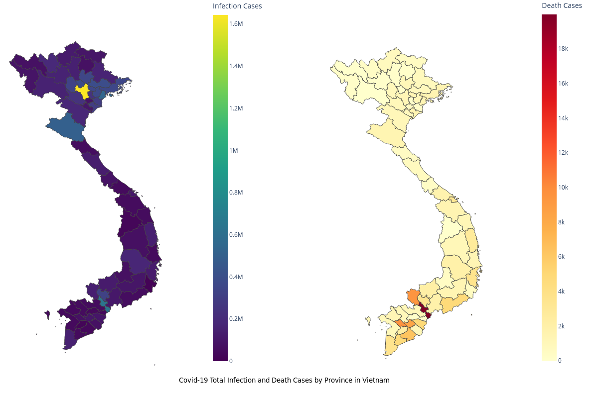

# Covid-19 total infection cases by province in Vietnam

[Main page](https://hoangnv735.github.io/covid-infection-visualization/index.html)

- [Infection cases Interaction graph](https://hoangnv735.github.io/covid-infection-visualization/infection.html)

- [Death cases Interaction graph](https://hoangnv735.github.io/covid-infection-visualization/infection.html)

Data collected from https://covid19.gov.vn/ (Update by 2023/05/25)

Visualization created using [plotly](plotly.com)

Map data is from [OpenDevelopmentMekong](https://data.vietnam.opendevelopmentmekong.net/vi/dataset/a-phn-tnh), simplified by [Mapshaper](Mapshaper.org)

